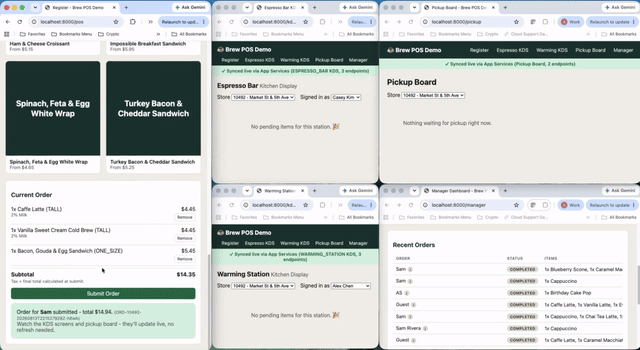

# Brew POS Demo (Couchbase Capella + App Services + Couchbase Lite)

A working point-of-sale demo modeled on how a modern coffee shop chain splits an
order across fulfillment stations - a register that takes the order, an
espresso bar and a warming station that each see only their own line
items, and a pickup board that lights up once every item is ready. It
exists to show a customer two things at once: a realistic **document data
model** for a high-throughput retail order system, and **real edge sync in
action** - every screen is a browser tab running its own local
[Couchbase Lite for JavaScript](https://docs.couchbase.com/couchbase-lite-javascript/current/index.html)
database, kept live by **Capella App Services** over channel-scoped
replication. No polling, no backend API for the app itself - a write on the
Register shows up on the right KDS screen because a Sync Gateway channel
routed it there, which you can watch happen.

Sample data for every collection lives in `data/samples/`; loading it into
Capella (so App Services has something to sync from) is a one-time admin
step, covered below.

## Demo



An order goes in on the Register and shows up live on both KDS screens and
the Manager Dashboard as it moves from queued to prepping to completed -
no refresh, no polling.

## Contents

- [Demo](#demo)
- [Architecture](#architecture)
- [Data model](#data-model)
- [Prerequisites](#prerequisites)
- [Setup](#setup)
- [Configuring App Services](#configuring-app-services)
- [Running the app](#running-the-app)
- [Guided demo script](#guided-demo-script)
- [Project layout](#project-layout)
- [Extending the demo](#extending-the-demo)
- [Troubleshooting](#troubleshooting)

## Architecture

```
 Register (/pos)      Espresso KDS         Warming KDS          Pickup Board        Manager
      │                     │                    │                    │                │
      ▼                     ▼                    ▼                    ▼                ▼
 ┌─────────────────────────────────────────────────────────────────────────────────────────┐
 │           Couchbase Lite for JavaScript - one local IndexedDB database per tab          │
 │     local SQL++ queries (live, reactive)      1-4 Replicators per page (continuous,     │
 │                                                 one per scope it needs - see below)     │
 └───────────────────────────────────────────────────────┬─────────────────────────────────┘
                                                           │  wss://.../catalog
                                                           │  wss://.../people       (4 App
                                                           │  wss://.../operations   Endpoints,
                                                           │  wss://.../inventory    1 per scope)
                                                           ▼
                                        Capella App Services (Sync Gateway)
                                        sync-functions.js route every write by channel
                                                           │
                                                           ▼
                                                   Capella Server
                                              bucket `brew` (source of truth)
```

FastAPI (`app/main.py`) only serves the page shells, static JS/CSS, and
injects the App Services connection details into each page
(`window.APP_SERVICES_CONFIG`) - it never touches order/menu data itself.
All of that lives in `app/static/js/cbl/`, loaded with **zero build
tooling**: `@couchbase/lite-js` ships a real browser ESM bundle, imported
straight from a CDN (`app/static/js/cbl/client.js`) - no npm install, no
webpack/vite.

**Why 1-4 Replicators per page, not 1**: Capella App Services ties each App
Endpoint to exactly one scope, so this data model's 4 scopes need 4 App
Endpoints (4 connection URLs). A page that needs collections from more than
one scope - Register needs all 4 - runs one `Replicator` per scope it
touches, all against the same local database. See
[Configuring App Services](#configuring-app-services) for the full setup.

The Couchbase **Server SDK** (`app/db.py`, `app/repositories/`,
`app/services/order_service.py`) still exists, but only for the one-time
admin scripts in `scripts/` that provision the bucket and load reference
data - App Services needs something to sync *from*. The live app never
imports them.

## Data model

Bucket **`brew`**, 4 scopes, 8 collections:

| Scope | Collection | Holds |
|---|---|---|
| `catalog` | `stores`, `menu_items`, `modifiers` | Reference data - stores, drink/food recipes, milk/syrup/topping pricing |
| `people` | `employees`, `customers` | Staff roster + loyalty profiles |
| `operations` | `orders`, `order_status_events` | The order itself, plus an append-only audit trail of every status change |
| `inventory` | `stock_levels` | Per-store ingredient stock, decremented as orders are placed |

Full schema, one real sample document per collection, the
entity-relationship diagram, and the exact N1QL/SQL++ indexes/queries this
app runs (both server-side and locally in the browser):
**[docs/data-model.md](docs/data-model.md)**.

**A note on menu images**: each `menu_item` has an `imageUrl` +
`imageSource` field. All items currently use a generated, brand-neutral
placeholder card (`imageSource: "placeholder"`). Swap in licensed assets
from your own DAM for a customer-facing build.

## Prerequisites

- Python 3.10+ (for the one-time admin scripts only)
- A modern browser: **Safari 17+, Chrome 142+, or Firefox 144+** (Couchbase
  Lite for JavaScript's minimums). Avoid private/incognito windows - they
  can restrict IndexedDB and make sync unreliable.
- A Couchbase Capella cluster (a free trial cluster is enough) with:
  1. A bucket named `brew` (Databases → your cluster → Buckets →
     Create Bucket - Capella ties bucket creation to storage/pricing
     settings, so this one step has to happen in the UI, not this repo's
     scripts).
  2. A database credential (Settings → Database Access) with read/write
     on that bucket, for the admin scripts.
  3. Your machine's IP allowed (Settings → Allowed IP Addresses), or
     "Allow Access from Anywhere" for a throwaway demo cluster.
  4. **Capella App Services** enabled on that cluster, for the live app -
     see [Configuring App Services](#configuring-app-services).

## Setup

```bash
cd brewpos
python3 -m venv .venv
source .venv/bin/activate          # Windows: .venv\Scripts\activate
pip install -r requirements.txt

cp .env.example .env
# edit .env: CB_CONN_STRING / CB_USERNAME / CB_PASSWORD from Capella's
# "Connect" tab and the DB credential you created above

python scripts/setup_capella.py    # creates scopes/collections + indexes
python scripts/seed_data.py        # loads data/samples/*.json
```

Both scripts are safe to re-run. Optionally pad out the order history so
the manager dashboard and KDS screens have more to show:

```bash
python scripts/generate_orders.py --count 30
```

This calls the same `order_service.create_order()` the admin scripts share,
so every generated order gets correct pricing, station routing, an
audit-trail event, and an inventory decrement - and each is randomly walked
partway through its lifecycle (some left `PAID`, some `IN_PREPARATION`,
`READY`, `COMPLETED`, or `CANCELLED`).

> **Note on the `couchbase` package**: it wraps the C++ SDK and builds a
> native extension on install. On macOS you'll need Xcode Command Line
> Tools (`xcode-select --install`); on Linux, `cmake` + a C++ compiler.
> See [Troubleshooting](#troubleshooting) if `pip install` fails there.

## Configuring App Services

This is what makes the live app actually sync - **[sync-gateway/app-services-setup.md](sync-gateway/app-services-setup.md)**
covers it in full, step by step (this data model's 4 scopes each need their
own App Endpoint - not one shared endpoint - plus CORS, the channel/role
table, a working demo credential, and how to verify it's connected). Short
version:

```bash
# in .env, after following the setup doc above:
APP_SERVICES_BASE_URL=wss://<app-id>.apps.cloud.couchbase.com:4984
APP_SERVICES_USERNAME=demo-web-app
APP_SERVICES_PASSWORD=...
```

You can skip this and still run the app - every page falls back to its
local, unsynced database with a clear amber banner explaining why, instead
of hanging or failing silently.

## Running the app

```bash
uvicorn app.main:app --reload
```

Then open:

| Page | URL | Role |
|---|---|---|
| Landing page / demo guide | http://localhost:8000/ | - |
| Register | http://localhost:8000/pos | Cashier taking an order |
| Espresso KDS | http://localhost:8000/kds/espresso | Barista |
| Warming KDS | http://localhost:8000/kds/warming | Warming partner |
| Pickup board | http://localhost:8000/pickup | Handoff to customer |
| Manager dashboard | http://localhost:8000/manager | Store manager |

Each page shows a small sync status banner right under the nav bar -
amber ("App Services isn't configured"), blue ("Connecting..."), green
("✓ Synced live"), or red (an actual error message, not swallowed).

## Guided demo script

1. Open **Register**, **Espresso KDS**, **Warming KDS**, and **Pickup
   Board** in separate tabs/windows so you can show them side by side -
   each is syncing independently.
2. On the Register, add a drink (try customizing milk + an extra shot)
   and a food item to the cart, then **Submit Order**. This writes to the
   Register's *local* Couchbase Lite database first, then replicates to
   App Services in the background.
3. Watch the drink line item appear **live, with no page refresh** on the
   Espresso KDS, and the food line item on the Warming KDS - each tab's
   Replicator only pulls its own station's channel
   (`store-{id}-espresso` / `store-{id}-warming`), so neither ever even
   receives the other's documents, even though both came from one order.
4. Click **Start** then **Mark Ready** on each screen. Once *every* item
   on the order is ready, the order itself flips to `READY` and appears
   live on the **Pickup Board**.
5. Click **Mark Picked Up**. Check the **Manager Dashboard** - the order
   now counts toward today's revenue and completed-order total.
6. To keep the KDS screens busy without manually placing every order, run
   in another terminal:
   ```bash
   python scripts/simulate_traffic.py --interval 4
   ```
   Add `--auto-advance` for a fully hands-off background demo. This writes
   straight to Capella Server via the admin path, same as
   `generate_orders.py` - and you'll see it show up live in the browser
   tabs exactly like a real register would, since App Services doesn't
   care whether a write came from Couchbase Lite or the Server SDK.

Every one of those clicks is a document write you can also watch happen
live in Capella's own UI (the document browser on `operations.orders`, or
App Services' own activity view) while the demo runs.

## Project layout

```
brew/
├── app/
│   ├── main.py               FastAPI: page routes + static files only, no data API
│   ├── config.py              Settings (.env) - CB_* for admin scripts, APP_SERVICES_* for the app
│   ├── db.py                  Couchbase Server SDK connection (admin scripts only)
│   ├── models.py               Pydantic schemas (admin scripts only)
│   ├── services/order_service.py   Order lifecycle logic - admin scripts only
│   ├── repositories/           KV + N1QL access - admin scripts only
│   ├── templates/               Register / KDS / pickup / manager page shells
│   └── static/
│       ├── css/style.css
│       └── js/
│           ├── api.js           money()/timeAgo() formatting helpers
│           ├── pos.js, kds.js, pickup.js, manager.js    Per-page UI logic
│           └── cbl/             Couchbase Lite for JavaScript layer (the actual app)
│               ├── client.js       Opens the local DB, declares the 8 collections
│               ├── replication.js  Starts a page-scoped Replicator + sync status banner
│               ├── query.js        Local SQL++ query helpers (live + one-shot)
│               ├── writes.js       Save/mutate helpers (LastWriteWins conflict policy)
│               ├── ids.js          Client-generated, collision-resistant document ids
│               └── orderLogic.js   Pure order-lifecycle logic (pricing, transitions, events)
├── data/samples/               One JSON file per collection, ready to seed
├── scripts/                    setup_capella / seed_data / generate_orders / simulate_traffic
│                                (Couchbase Server SDK admin tooling - not the live app)
│                                + assign_app_service_channels.py (App Services Admin API)
├── sync-gateway/                sync-functions.js + App Services setup guide
└── docs/data-model.md           Full schema, ER diagram, sample docs, indexes
```

## Extending the demo

- **Add a station** (e.g. a blender/cold-bar station separate from
  espresso): `station` is a free-form string on `menu_items` and order
  line items - add the value, a matching KDS route in `app/main.py`
  (`/kds/cold-bar`) + `app/templates/kds.html` reuse, and a channel in
  `sync-functions.js` + the credential's channel grants. No schema
  migration needed.
- **Add loyalty point accrual**: `app/static/js/cbl/orderLogic.js`'s
  `completeOrder()` is the natural hook - add stars to
  `customers.loyalty.starsBalance` there (and save the customer doc).
- **Add a second store's full menu variation**: `menu_items` doesn't
  currently vary by store; if you want that, add a `storeId` (or
  `availableAtStores`) field and filter accordingly in `pos.js`'s menu
  query.
- **Harden App Services access**: swap the single shared demo credential
  for per-role credentials (register / espresso-kds / warming-kds /
  pickup / manager), each with only the channel grants it needs - see the
  "Hardening later" note in `sync-gateway/app-services-setup.md`.

## Troubleshooting

- **`pip install` fails building `couchbase`**: install build
  prerequisites first - macOS: `xcode-select --install`; Debian/Ubuntu:
  `sudo apt-get install cmake build-essential`. Then retry. (This only
  affects the admin scripts' dependencies, not the live app.)
- **`setup_capella.py` exits saying the bucket wasn't found**: create the
  `brew` bucket in the Capella UI first (see
  [Prerequisites](#prerequisites)) - the SDK can create scopes/collections
  but not the bucket itself on Capella.
- **Connection hangs / times out (admin scripts)**: check Settings →
  Allowed IP Addresses on the cluster includes your current IP, and that
  `CB_CONN_STRING` is the `couchbases://...` string from the cluster's
  Connect tab (note the `s` - Capella requires TLS).
- **N1QL queries return nothing right after `setup_capella.py`**: index
  builds are asynchronous; give it 10-20 seconds on a fresh cluster
  before running `seed_data.py`.
- **A page's sync banner stays amber**: `.env` doesn't have
  `APP_SERVICES_BASE_URL`/`_USERNAME`/`_PASSWORD` set, or the app wasn't
  restarted after editing `.env`. The page still works locally in the
  meantime; it just won't see writes from other tabs.
- **A page's sync banner goes red**: the error message is the actual
  `Replicator` error, not a generic failure - check it and the browser
  console first (each of a page's Replicators logs separately, tagged
  `scope=catalog`/`people`/`operations`/`inventory`, so the console tells
  you which of the 4 App Endpoints is the problem). The most common
  causes are CORS not enabled on that particular endpoint (each of the 4
  needs it set individually; see the setup doc §2), an endpoint name that
  isn't exactly `catalog`/`people`/`operations`/`inventory`, or that
  endpoint's App User missing a channel grant.
  - `TypeError: Failed to fetch` / "Server connection failed... CORS
    settings" specifically on a `POST .../_session` call is CORS, not a
    real connectivity problem - almost always **Login Origin** left blank
    on that endpoint (required, but easy to miss - Save won't enable
    without it) or **Custom HTTP Headers** not actually containing
    `Authorization, Content-Type` as one comma-separated value. See the
    setup doc §2 step 9 for the exact field behavior - it's not a
    tag/chip field the way the App User channel field is, and that
    difference tripped this up on first contact.
- **Banner goes green but the menu grid stays empty**: a green banner
  only means the Replicator connected and finished, not that it synced
  anything - this is almost always a server-side setup step, not a bug.
  Check DevTools → Application → IndexedDB → `brew-pos` →
  `catalog.menu_items` first: if it's genuinely empty, the two most
  likely causes (in order) are **Import Filter** not enabled on that
  collection, or still left on Capella's default `doc.type == "mobile"`
  filter (which excludes every document this app writes), and the
  **sync function** for that collection never actually being saved (a
  document landing in a channel with the same name as its collection is
  the tell - that's Sync Gateway's no-custom-function default). See the
  setup doc §2 steps 7-8, and re-run `python scripts/seed_data.py` after
  fixing either one, since import only applies to future mutations.
- **KDS shows nothing even though an order was placed**: confirm the
  App User on the **`operations`** App Endpoint specifically has that
  store's `-espresso`/`-warming` channel granted (see
  `sync-gateway/app-services-setup.md` §3) - a channel grant gap on that
  one endpoint is the most likely first-contact issue with a
  freshly-configured App Services app. `python scripts/assign_app_service_channels.py`
  sets all 4 endpoints' channels in one go instead of clicking through
  the UI 4 times, if you haven't run it yet.
- **`assign_app_service_channels.py` can't connect**: your current IP
  probably isn't in this App Service's Settings > Allowed IP list yet -
  that's required for the Admin API it calls, separate from the Allowed
  IP list on the Capella *cluster* itself and from the CORS origin(s) you
  set per endpoint. (A 401 `"Login required"` instead means it's reaching
  the API fine but the Basic Auth credential is wrong - it uses
  `APP_SERVICES_ADMIN_USERNAME`/`PASSWORD` from `.env`, falling back to
  `APP_SERVICES_USERNAME`/`PASSWORD` if those are blank; double check
  whichever pair is actually in effect is set correctly.)
- **Local `scope.collection` naming**: Couchbase Lite for JavaScript is a
  very new SDK (GA'd Nov 2025); `app/static/js/cbl/client.js` declares
  local collections as dotted `"scope.collection"` strings per its
  official docs, and local queries reference them the same way,
  backtick-quoted (e.g. `` `operations.orders` ``). If a query or
  replication call errors specifically on collection naming once you
  connect to a real App Services endpoint, that's the first thing to
  double-check against whatever the SDK's behavior turns out to be at
  your installed version.
